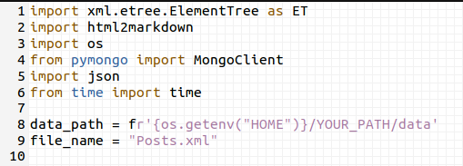

## Agence Stark

In our agency, we was pleased to devlop a chatbot connected to discord api. This bot is able to help you/ your communauty on any topic in astronomy, earthscience, space, electronic and engigneering. You may enjoy having an amazing conversation with him and discover her personnality. Please feel free to use it and made us constructif feedbacks to improve it.

#### Collaborateurs : 

  - A Constant (https://github.com/AmosConstantjunior)
  - B Anthony (https://github.com/AnthonyBonfils3)
  - B Myriam (https://github.com/MyriamBou)
  - M Jean-Pierre (https://github.com/jpphi)
  - P Olivier (https://github.com/Olivier-Prince)
  - R Ludovic (https://github.com/Ludo-R)

_______________________________________________________
  
### How to use :

_______________________________________________________

### Step 1-- Download files

Clone the repositary with :

	git clone https://github.com/Ludo-R/brief-AGILE-chatBot

To create your database :

	create_DB.py 

To add a dataset from **data folder** to your **StarkBotBD** MongoDB.  
Use dataset from Stackexchange : https://archive.org/download/stackexchange
You have just to edit the two first lines with your path, and dataset subfolder to data folder.

If you want to add another dataset from everywhere, 
you need to edit the target of query (actually "Title") and some other things ...

(This step would need some knowledge to install and run MongoDB)
You may found some help here : https://docs.mongodb.com/manual/installation/

_______________________________________________________

### Step 2-- Create bot

Create your own BOT on https://discord.com/developers/applications
	
	-Select -> New Applications
	-Pick a name and select Creat
	-Go in "Bot" Section and select : Add bot
	-Go in "OAuth2" Section select "Bot" in the second columns, and below select Permission you want to give to your bot
	-Copy the link in pop-up
	-Paste it in your web browser, select your server where you are Admin & select GO

_______________________________________________________

### Step 3-- Connect bot

Go back on https://discord.com/developers/applications
In "Bot" Section COPY the "Token"

Open :
	
	stark.py

Past your token on the last line in :

	client.run('PAST YOUR TOKEN')

Run stark.py

### ENJOY ! Your new friend is Ready ;-)
 
